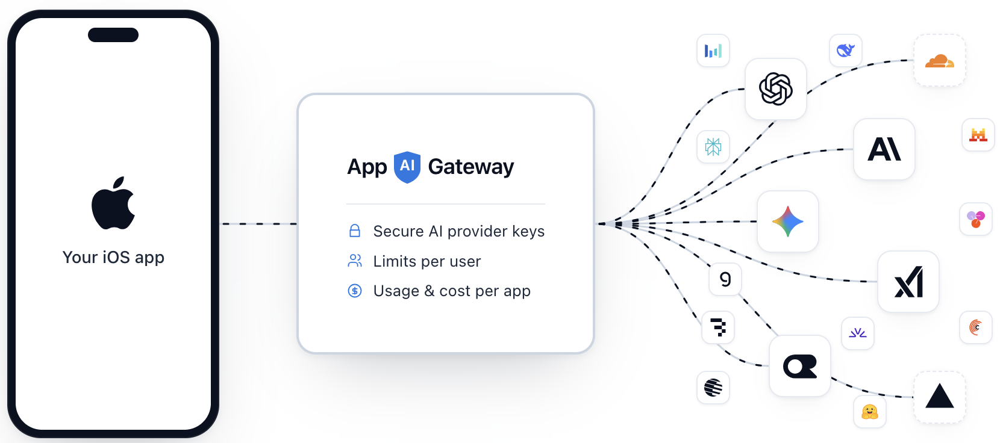

# App AI Gateway

App AI Gateway is the backend for the AI features in your iOS apps, so you do
not have to write one. The app calls the gateway, and the gateway calls OpenAI,
Anthropic, Gemini or whichever provider you use.



- 🔑 Your provider API keys stay out of the app. A key shipped inside an iOS
  app can be pulled out of it, and then someone else spends your money on your
  account.
- 🧩 One gateway serves all your apps. You add an app in the console instead of
  building and running a separate backend for each one.
- 🔒 Provider keys are encrypted before they are stored, either in the
  gateway's own vault or in a KMS you deploy separately.
- 🛡️ Requests are checked before they reach a provider:
  - that they come from a real install of your app, using Apple App Attest,
  - that they come from a signed-in user,
  - that they come from a user with a paid subscription, where you require one.
- 💰 You set what an app and its users may spend:
  - request limits and a monthly budget per user,
  - a monthly budget per app.
- 📊 The console shows where the money went, which requests failed and why, and
  lets you block a user who is running up your bill.

**[Documentation](https://docs.appaigateway.com/)** ·
**[API reference](https://docs.appaigateway.com/api/)**

## One-click deployment to Cloudflare

[](https://deploy.workers.cloudflare.com/?url=https://github.com/maxceem/app-ai-gateway)

A Cloudflare account is all you need. The deployment form asks for one value:

| Variable | How to obtain it |
| --- | --- |
| `SECRET_VAULT_LOCAL_KEK_V1` | Run `openssl rand -base64 32`. It encrypts the provider keys you add later in the console, so back it up — losing it makes them unreadable. |

Everything else is provisioned for you. When the deployment finishes, open the
console, create the first account, and add your provider keys.

## Run locally

Requirements: Node.js 22+, pnpm 11, and Wrangler 4.

```sh
pnpm install
cp .dev.vars.example .dev.vars
# Put `openssl rand -base64 32` into SECRET_VAULT_LOCAL_KEK_V1
pnpm run secrets:setup-local
pnpm run db:migrate:local
pnpm run dev
```

The gateway and console run together at `http://localhost:5173`: Vite serves the
console with hot reloading and runs the Worker beside it on the same origin, so
an edit to either is live without a rebuild.

## License

This project is licensed under the [Apache License 2.0](LICENSE).
